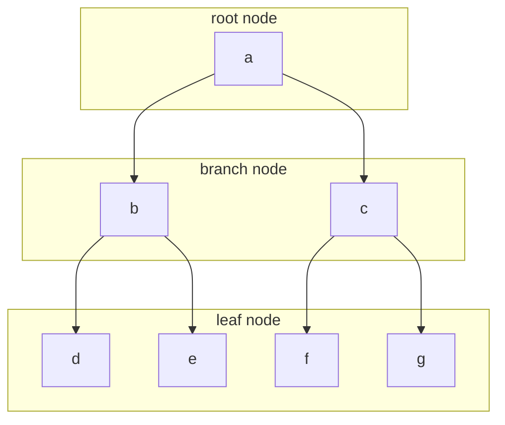

# DB index

## インデックスの内部構造
### BTree
- Balanced Tree
  - 構造
    - ルートノード、ブランチノード、リーフノード

  - 木構造の計算量は木の深さ(ルートノードからリーフノードまでの距離)に依存する
  - 各リーフノードに対する木の深さを同じに保ってくれる構造
- 計算量
  - 検索`log(n)`
    - ツリーの走査という
    - (図)
  - 挿入`log(n)`
  - 更新`log(n)`
  - 削除`log(n)`
  - `n`と`log(n)`の比較
    - (図)
### B+Tree
- BTreeのリーフノードを双方向連結リストにしたもの
  - (図)
- リーフノードを辿るのをリーフノードの走査という
### クラスタインデックスとセカンダリインデックス
#### クラスタインデックス
- 主キーに作られるインデックス
- 自動的に作成される

#### セカンダリインデックス
- ユーザーが定義するインデックス
- リーフノードに設定したカラムの値とPKの値が入っている
- 実データにアクセスするときはPKの値を使ってクラスタインデックスを探索する

## WHERE句
### 等価演算子
#### 単一
- プライマリーキーでの検索(/queries/primary_key)
  - インデックスツリーの走査のみ
  - 一意に決まることが保証されているのでリーフノードの走査は行われない
  - 実行計画では{type: const}となる。
- プライマリーキー以外の検索
  - 一意(/queries/unique_key)
    - UNIQUE制約設定されたカラムには自動的にインデックスが作成される
    - 実行計画: {type: const}
  - 一意ではない(queries/not_unique_key)
    - インデックスツリーの走査とリーフノードの走査が行われる
    - 実行計画では{type: ref}

#### 複合
- 順番(queries/mulit_column_index)
  - id1, id2, id3で作成した場合
    - id1, id1&id2, id1&id2&id3を指定した検索は効く
      - 実行計画: {type: ref}
    - それ以外を指定した検索は効かない
      - ~~フルテーブルスキャンになる~~
      - フルインデックススキャンになる
      - 実行計画: {type: index}
      - インデックスコンディションプッシュダウンというもので使われることもある[参考14:30~](https://youtu.be/4Zj7Qgvt7RE?si=AIpn9un92sSdm1ta)

#### フルテーブルスキャンよりインデックス検索の方が遅くなるパターン
- インデックスにあるカラムとないカラムを条件に指定した場合(index_col_and_no_index_col)
  - インデックスを使って検索
  - そのデータを取り出してインデックスにないカラムの条件でフィルターする
- mysqlで`2^20`のデータにフィルターをかける処理を書いたがフルテーブルスキャンを使わなかった(?)

### 関数インデックス(今回はスキップ)
mysql8.0.13以降は使える[参考](https://dev.mysql.com/doc/refman/8.0/en/create-index.html)
- WHERE句で関数値を指定するとき(ex. where f(num) = 1)にインデックスを効かせることができる
  - create index f(num);
  - index numは効かない
- 関数インデックスは確定的でないといけない(同じ条件でも実行する環境によって値が変わるものには使えない)
  - ex. 現在時刻を関数値の計算に使う場合など

### 範囲検索
[参考](https://use-the-index-luke.com/ja/sql/where-clause/searching-for-ranges)
#### 大なり小なりBETWEEN(のみ)(範囲検索)
utilに載っていない
要調査
ツリーの走査は指定した値を探すのではなく、指定した値以下の中で最大のもの（または指定した値以上で最小のあたい）を見つける操作をしている？
BTreeに存在しない値の探索

#### 範囲条件と等価条件の複合(*)
- 等価条件に使われるカラムをより最初にしてインデックスを作るとよい
- インデックスは等価性(ツリーの走査)を調べた後に、範囲(リーフノードの走査)を調べるために使われる
- 等価カラムと範囲カラムの順番による違い
  - 等価カラム、範囲カラムの場合
    - 等価カラムを使って、リーフノードまで辿り着く
    - リーフノードを走査して、範囲カラム（等価カラム）の条件に当てはまるものを取得
      - 走査範囲で範囲カラムがソートされていることが保証されるので、余計な走査が行われない（途中で打ち切りができる）
  - 範囲カラム、等価カラムの場合
    - 範囲カラムを使って、リーフノードまで辿り着く
    - リーフノードを走査して、等価カラム（範囲カラム）の条件に当てはまるものを取得
      - 走査範囲で等価カラムがソートされていることが保証されていないので、必ず範囲全体を走査しないといけない（途中で打ち切りができない）

#### LIKE演算子(/queries/like)
- 前方一致のみにインデックスが効く
  - LIKE 'hoge%', LIKE 'hoge%hoge'
  - 選択性が高くないとパフォーマンスが出ない
- 後方一致には効かない
  - LIKE '%hoge'
- 部分一致検索ではインデックスを効かせられない
  - LIKE '%hoge%'
  - 全文検索には他の方法を用いる(時間があったら調査)
    - FULLTEXT INDEX
      - [参考](https://dev.mysql.com/doc/refman/8.0/en/fulltext-search.html);

#### インデックスの結合(x)
[参考](https://use-the-index-luke.com/ja/sql/where-clause/searching-for-ranges/index-merge-performance)
- 別々のカラムを範囲検索
  - 2つのカラムに対する複合インデックス
    - 選択性の高いカラムを先に置く
  - 各々のカラムのインデックスを作成
    - 各々のインデックスをつかって対象のデータを検索
    - 各々の検索結果の積集合を返す
    - using intersect

## ORDER BY(/queries/order_by)
- order by句がインデックスによる順序付けと一致している場合、ソート処理を省略できる
  - index id1, id2: where id1= order by id1, id2
  - index id1, id2: where id1= id2(range) orderby id2
- 一致していない場合はソートをしないといけない
  - クイックソート(nlogn)
### ASC, DESC(*)?
- 指定するカラムが単一
  - ASC, DESCどちらでもインデックスが使える
- 複数
  - ASC, DESCが一致していれば良い
  - indexにASC, DESCを指定できる

## カバリングインデックス(*)
- selectする列と使うインデックスの列が一致
- count

## update, delete, insert(*)
- 各操作後に存在するインデックスを更新することになるので、インデックスが多いほど処理が遅くなる
- update, deleteのターゲットの絞り込みで使える

## 調べること
- DBによるインデックスの内部実装の違い
  - B+Treeインデックス
  - クラスタ化インデックス
- [x] 大量のデータを作成する方法
- [x] クエリの実行時間計測方法
## 各項目でまとめること
- インデックスあり、なしの時の結果
  - 実行時間
    - timeコマンドのuserを見る(参考程度)
  - 実行計画
  - （ありの時の）インデックスツリーの使われ方
- 欲しいクエリ
  - テーブル定義
  - データ生成
  - インデックス作成
  - 全行削除
  - テーブル削除

## DBコンテナの扱い
- DBデータ永続化削除
  - `docker volume rm db_index_test_index_db_data`
- DBコンテナに入る
  - `docker exec -it mysql /bin/bash`
- SQLファイルの実行
  - Sequal-Aceで実行
  - entrypointディレクトリをバインドして、初期実行するようにする
  - `mysql -uuser -ppassword db < .sql`

## 参考URL
[USE THE INDEX LUKE](https://use-the-index-luke.com/ja)
[参考14:30~](https://youtu.be/4Zj7Qgvt7RE?si=AIpn9un92sSdm1ta)