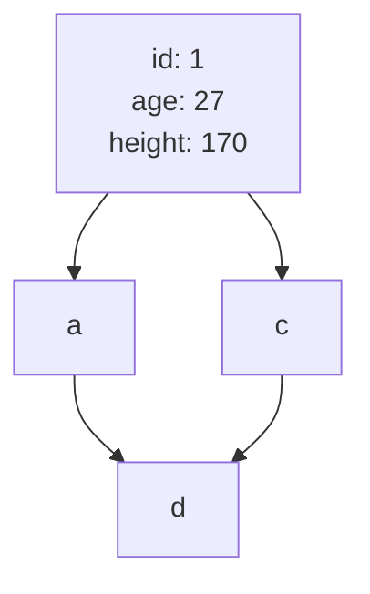

# DB index

## インデックスの内部構造

```mermaid
flowchart TD;
  a[
    id: 1
    age: 27
    height: 170
  ]
    -->
  b[
    a
  ];
  a-->c;
  b-->d;
  c-->d;
```

## WHERE句

## 調べること
- DBによるインデックスの内部実装の違い
  - B+Treeインデックス
  - クラスタ化インデックス