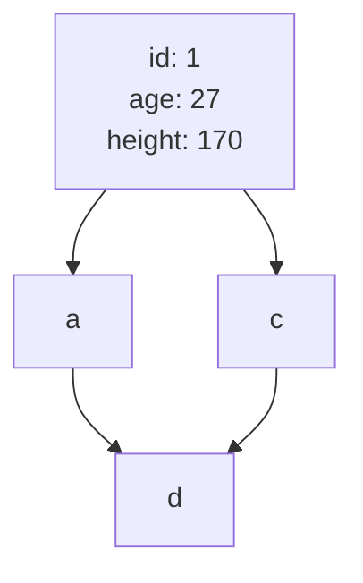

# DB index

## インデックスの内部構造

## WHERE句
### 等価演算子
### 複合インデックス
### 大なり小なりBETWEEN
### LIKE
## ORDER BY
### file sort
### カバリングインデックス

## 調べること
- DBによるインデックスの内部実装の違い
  - B+Treeインデックス
  - クラスタ化インデックス
- 大量のデータを作成する方法
- クエリの実行時間計測方法
## 各項目でまとめること
- インデックスあり、なしの時の結果
  - 実行時間
  - 実行計画
  - （ありの時の）インデックスツリーの使われ方

## DBコンテナの扱い
- データの削除
  - ``
- SQLファイルの実行
