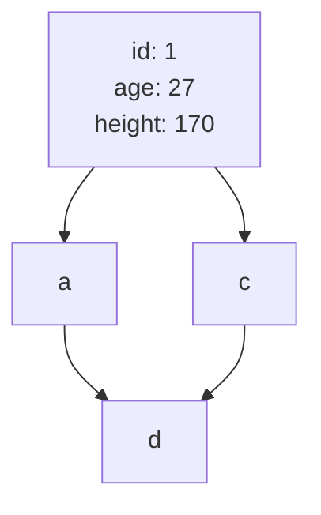

# DB index

## インデックスの内部構造

## WHERE句
### 等価演算子
### 複合インデックス
### 大なり小なりBETWEEN
### LIKE
## ORDER BY
### file sort
### カバリングインデックス

## 調べること
- DBによるインデックスの内部実装の違い
  - B+Treeインデックス
  - クラスタ化インデックス
- [x] 大量のデータを作成する方法
- [x] クエリの実行時間計測方法
## 各項目でまとめること
- インデックスあり、なしの時の結果
  - 実行時間
  - 実行計画
  - （ありの時の）インデックスツリーの使われ方
- 欲しいクエリ
  - テーブル定義
  - データ生成
  - 全行削除
  - テーブル削除

## DBコンテナの扱い
- DBデータ永続化削除
  - `docker volume rm db_index_test_index_db_data`
- DBコンテナに入る
  - `docker exec -it mysql /bin/bash`
- SQLファイルの実行
  - Sequal-Aceで実行
  - entrypointディレクトリをバインドして、初期実行するようにする
