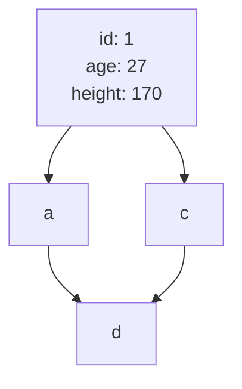

# DB index

## インデックスの内部構造

## WHERE句
### 等価演算子
#### 単一
- プライマリーキーでの検索
  - インデックスツリーの走査のみ
  - 一意に決まることが保証されているのでリーフノードの走査は行われない
  - 実行計画では{type: const}となる。
- プライマリーキー以外の検索
  - 一意
    - PKでの検索と同様？
  - 一意ではない
    - インデックスツリーの走査とリーフノードの走査が行われる
    - 実行計画では{type: ref}

#### 複合
- 順番
  - id1, id2で作成した場合
    - id1, id2を指定した検索は効く
    - id1を指定した検索は効く
    - id2を指定した検索は効かない
      - フルテーブルスキャンになる

#### フルテーブルスキャンよりインデックス検索の方が遅くなるパターン
- index range scanの範囲が広くなってしまう
  - 例. id1のインデックスを貼っていて、id1, nameを使った検索をする
  - id1に当てはまるデータが大量にある場合、各リーフノードのデータを取得して、nameが当てはまるか検証するので遅くなる
  - 対処法
    - id1, nameのインデックスを作る
  - 本来は統計情報をオプティマイザが見て、どの方法でデータを取得するかを計算する
    - (要調査)mysqlの統計情報、コスト計算を見る方法

### 複合インデックス
### 大なり小なりBETWEEN
### LIKE
## ORDER BY
### file sort
### カバリングインデックス

## 調べること
- DBによるインデックスの内部実装の違い
  - B+Treeインデックス
  - クラスタ化インデックス
- [x] 大量のデータを作成する方法
- [x] クエリの実行時間計測方法
## 各項目でまとめること
- インデックスあり、なしの時の結果
  - 実行時間
    - timeコマンドのuserを見る(参考程度)
  - 実行計画
  - （ありの時の）インデックスツリーの使われ方
- 欲しいクエリ
  - テーブル定義
  - データ生成
  - インデックス作成
  - 全行削除
  - テーブル削除

## DBコンテナの扱い
- DBデータ永続化削除
  - `docker volume rm db_index_test_index_db_data`
- DBコンテナに入る
  - `docker exec -it mysql /bin/bash`
- SQLファイルの実行
  - Sequal-Aceで実行
  - entrypointディレクトリをバインドして、初期実行するようにする
  - `mysql -uuser -ppassword db < .sql`

## 参考URL
[USE THE INDEX LUKE](https://use-the-index-luke.com/ja)
